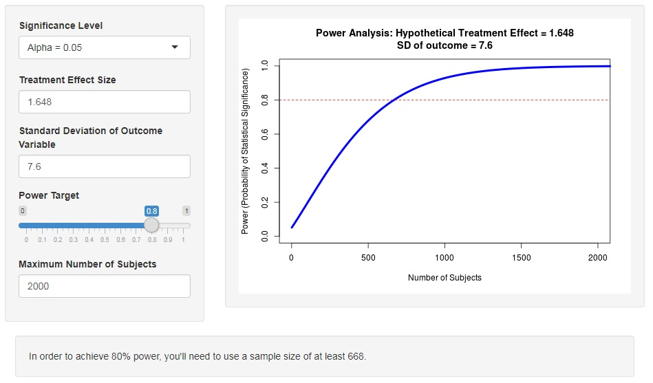
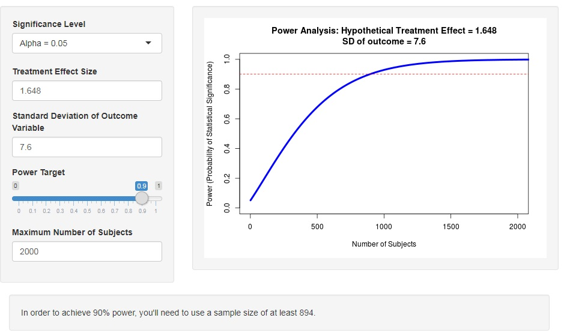

---
```{r setup, include=FALSE,echo=FALSE}
rm(list = ls())
knitr::opts_chunk$set(echo = TRUE)
knitr::opts_chunk$set(dev = 'pdf')
knitr::opts_chunk$set(cache=TRUE)
knitr::opts_chunk$set(tidy=FALSE)
knitr::opts_chunk$set(prompt=FALSE)
knitr::opts_chunk$set(fig.height=3)
knitr::opts_chunk$set(fig.width=3)
knitr::opts_chunk$set(warning=FALSE)
knitr::opts_chunk$set(message=FALSE)
knitr::opts_knit$set(root.dir = ".")
library(latex2exp)   
library(pander)
library(ggplot2)
library(GGally)
```


## Power Calculations for Follow On Study of Cardiac rehabilitation

We aim to perform power calculations for a follow on study [@Sibilitz1995] to establish the effect of a cardiac rehabilitation program on patients undergoing heart valve surgery. The patients are to be divided into two groups - a control with no treatment and a group recieving the cardiac rehabilitation.  The 4 month VO2 max will be used as the response to determine the efficacy of the rehabilitation. 

In the original study the authors transform the measured VO2 response data using first a log and then a Box-Cox transformation. It's clear there is some skew in the data from the VO2 plots in figure 2. The mean response for the two groups are reported in log scaled and unscaled units. In the results outcome section a number is given for the crude standard deviation - 7.6.  This appears to be a reasonable estimate visually of the common standard deviation of the 2 groups.  What does not appear in the paper is the standard deviation of the log transformed data.  Without the raw data we're going to have to be creative in how we perform our power calculations. 

Using the log of the crude SD is not the best way to go.  If we had a parametric form of the untransformed data we could work out what the transformed SD would be. Let's fix some notation for the remaining of discussion.

Let $\nu_0$ be the group mean for the treatment group, $\nu_1$ be the group mean for the control group.  Then the test we seek to perform is $H_0 : \nu_0=\nu_1$ versus the alternative $H_A : \nu_0<\nu1$.  This is a one sided hypothesis test.  The significance $\alpha=0.05$ and we're asked to perform the power calculations for power levels $1-\beta=0.8$ and $1-\beta=0.9$   

Three methods were tried 

- The power calculation tool https://egap.shinyapps.io/Power_Calculator/ was used in 2 ways - once on the original scale with crude SD and once in the log transformed scale with the log of the crude SD.  
- R stats package power.t.test
- calculation by hand from the formula in Walpole's text [@2007probability] 

The online calculations did *not* agree with the others so we put those last and gave the section a large warning!
The hand calculated results agreed with the R method so we report those. The online calculations did *not* agree with the others.  They are included n the homework with a cautionary tale of using the internet and gave the section a large warning!

In experimenting with the parameters of the tests it was determined that increasing SD, decreasing the effect size, or increasing the power all gave rise to increases in the required sample size.

Below are the results obtained using the power.t.test method.

#### Unscaled 

*Power = 0.8 => n = 263*

*Power = 0.9 => n = 364*

#### Scaled 

*Power = 0.8 => n = 204*

*Power = 0.9 => n = 282*


### Unscaled power calculations
```{r}
power.t.test( delta = 1.648, sd = 7.6, sig.level = 0.05,
             power = .8,
             type = "two.sample",
             alternative = "one.sided")

power.t.test( delta = 1.648, sd = 7.6, sig.level = 0.05,
             power = .9,
             type = "two.sample",
             alternative = "one.sided")

```


### Scaled power calculations

```{r}
power.t.test( delta = 0.5, sd = log(7.6), sig.level = 0.05,
             power = .8,
             type = "two.sample",
             alternative = "one.sided")

power.t.test( delta = 0.5, sd = log(7.6), sig.level = 0.05,
             power = .9,
             type = "two.sample",
             alternative = "one.sided")

```

We double check one of the calculations in R using the formula obtained in [@2007probability] for the one sided test for an effect e;

$$ n = \frac{(z_{\alpha}+ z_{\beta})^2 (2 \sigma^2)}{e}$$

```{r}
d <- ( qnorm(0.95) + qnorm(0.8))^2 *(2*7.6^2) / 1.648^2 
pander(data.frame(sample=d),caption="sample size for power 0.8")


d <- ( qnorm(0.95) + qnorm(0.9))^2 *(2*7.6^2) / 1.648^2 
pander(data.frame(sample=d),caption="sample size for power 0.9")
```


## BAD RESULTS FROM ONLINE POWER SHINY APP!!!

I include this section as a caution against online tools like the one described above.  I'm not sure if I used it wrong - but I checked the results for one of the calculations by hand and didn't get the same results. I reverted to using the power.t.test function in the R stats package which did agree with the hand calculations. 

For the case that we use unscaled measurements (assumptions of normality are questionable here) the reported sample size requirements to measure an effect of $e^{0.5}$ are $n=668$ at a power of $0.8$ and $n=811$ at a power of $0.9$.

For the case that we use scaled measurements and the log of the crude SD (SD is questionable here) the reported sample size requirements to measure an effect of $0.5$ are $n=513$ at a power of $0.8$ and $n=686$ at a power of $0.9$.

Given the nature of the study and the positive effects of the previous one we'd argue that it's in our best interest to use the larger sample sizes.   





\newpage


```

## Bibliography

